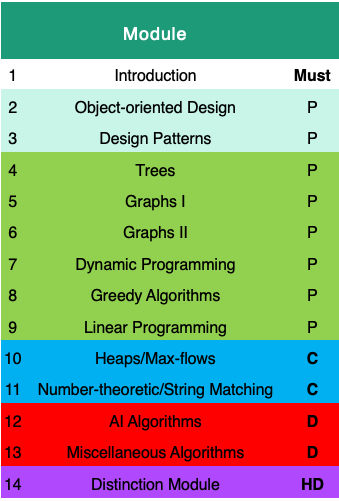
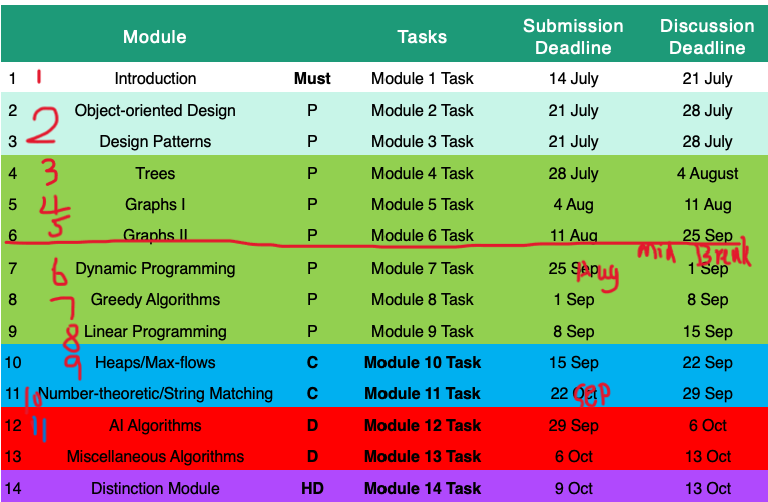

There are 14 Modules, 14 tasks in 11 Weeks

* 11 Weeks

  + Monday 10 July - Friday 29 September
  + mid break: Monday 14 August - Sunday 20 August
    
  + One assessment task associated with each module
    + Write a 2-3 page reflection on what you have learned.
    + Collect and document all the activities that you have done as part of completing the module.
    + Deadlines
      
